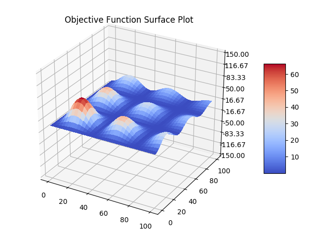
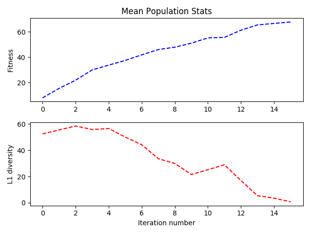

# GeneticAlgorithmsRepo
An assortment of genetic algorithms - all written from scratch, for Python 3.5.
### Objective Function Maximization

  

**fmga** is a genetic algorithms package for arbitrary function maximization.  
fmga is available on PyPI - latest version 2.3.0 - and now supports multiprocessing!   
```bash
pip install fmga
```
For more details, please see the README in the **fmga** subdirectory.

The objective function doesn't have to be differentiable, or even continuous in the specified domain!  
The population of multi-dimensional points undergoes random mutations - and is selected through elitism and raking selection with selection weights 
inversely proportional to fitness and diversity ranks.  

**fmga_plots.py** contains relevant code on obtaining surface plots of the function (if 2-dimensional), initial population and final population graphs, as well as line plots of mean population fitness 
and L1 diversity through the iterations.  
Completely customizable - licensed under the MIT License.



### Minimum Vertex Cover for Graphs
**vertex_cover.py** gives a genetic algorithm heuristic to the well-known NP-Complete Minimum Vertex Cover problem - given a graph, find a subset of its vertices such that every edge has an endpoint in this subset.  
This is an implementation of the OBIG heuristic with an indirect binary decision diagram encoding for the chromosomes, which is described in this paper by Isaac K. Evans, [here](https://pdfs.semanticscholar.org/4309/66ae3423f07738748f6cd5cef4f108ca87ea.pdf).  
A [networkx](https://networkx.github.io/) graph is used as an input - and a population of vertex covers mutates and breeds to find an minimum vertex cover.
As above, elitism and breeding with selection weights inversely proportional to fitness and diversity ranks are used to generate the new population.  
The fitness of each vertex cover is defined as: 
<p align="center"> 

